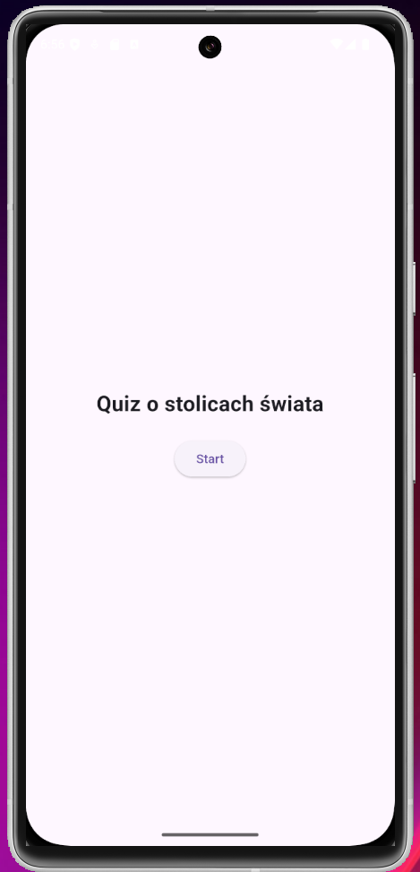
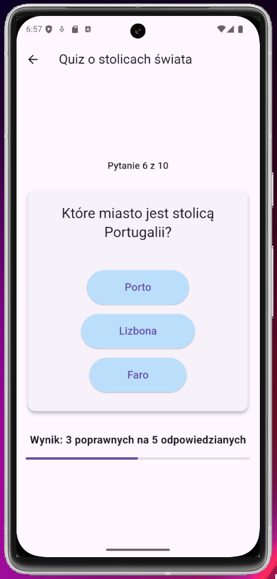
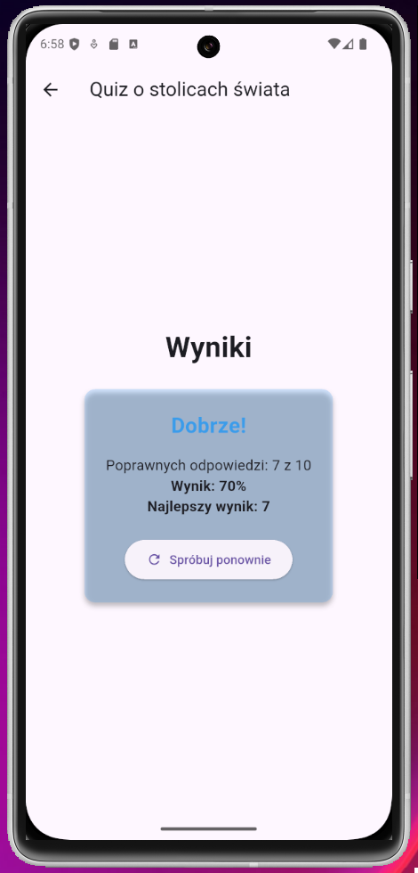

# *🧠 Quiz App*

**Quiz App** to klasyczna gra typu quiz, stworzona we Flutterze, umożliwiająca sprawdzenie swojej wiedzy odnośnie geografii.





## **📌 Funkcjonalności**
* **Odpowiadanie na pytania** gracz odpowiada na 10 pytań, każde z nich ma 3 odpowiedzi z czego 1 poprawną.
* **Aktualny wynik** cały czas wyświetlany jest aktualny wynik po każdym pytaniu.
* **Wynik** po odpowiedzeniu na pytania, wyświetla się zdobyty wynik - na jego podstawie odpowiedni komunikat, oraz najwyższy wynik zdobyty przez wszystkie rozgrywki w sesji.

## **🛠 Technologie**
* **Dart**
* **Flutter** 
* **Riverpod**
* **Freezed**


## **🚀 Uruchomienie**
1. **Zainstaluj zależności**:
   ```sh
   flutter pub get

2. **Uruchom aplikację**
   ```sh
   flutter run
3. **Otwórz na emulatorze lub przeglądarce**
